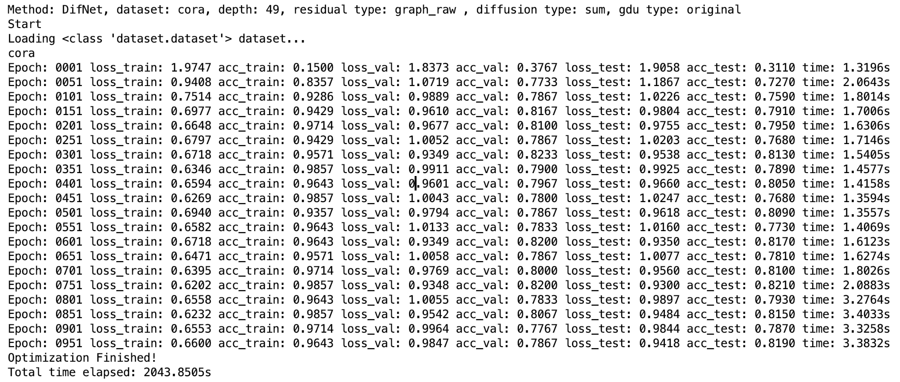

# DifNet

Source code of Deep Diffusive Neural Network.

Please run script with python 3. It requires pytorch as the pre-required deep learning toolkit.

---------------------------------------------------------------------------------------------------------------

---------------------------------------------------------------------------------------------------------------

---------------------------------------------------------------------------------------------------------------
